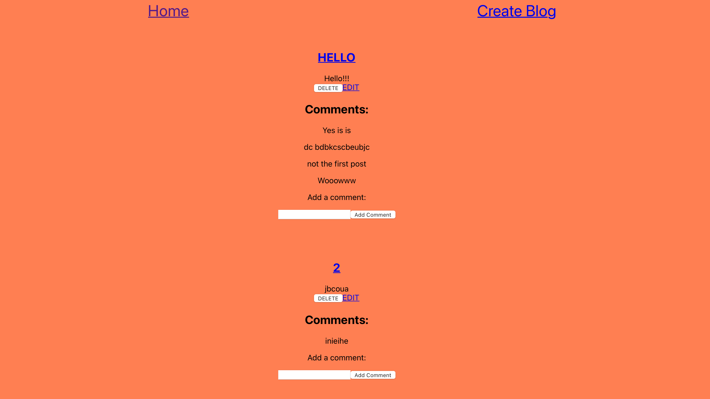

# Project Name: Blog Website

## Introduction
The Blog Website is a full-stack web application that provides a platform for users to express their thoughts and share ideas through blogging. Users can create blog posts with rich content and interact with other users through the platform. The application offers easy-to-follow interface for reading and engaging with blog posts.

## Technologies Used
The following technologies, libraries, and APIs were used in the development of this project:

- React.js
- Node.js
- MongoDB
- Mongoose
- Express.js
- HTML
- CSS
- JavaScript
- Axios
- JSON Web Tokens (JWT)

## Getting Started
To get started with the Blog Website, you can access the following resources:

- Deployment: The application is deployed on Vercel. You can access the deployed app [here](https://blog-website-frontend-nine.vercel.app).
- Backend-repo: The backend server reop is located [here](https://github.com/amamat48/Blog-website-backend/tree/main)

## Unsolved Problems
- Authentication using JWT authentication and authorization is yet to be implemented.

## Future Enhancements
- Implement user sign up, login, and logout functionality.
- Add user authorization to restrict access to certain features.
- Enhance the user interface with additional styling and responsiveness.
- Implement search functionality to allow users to find specific blog posts.

